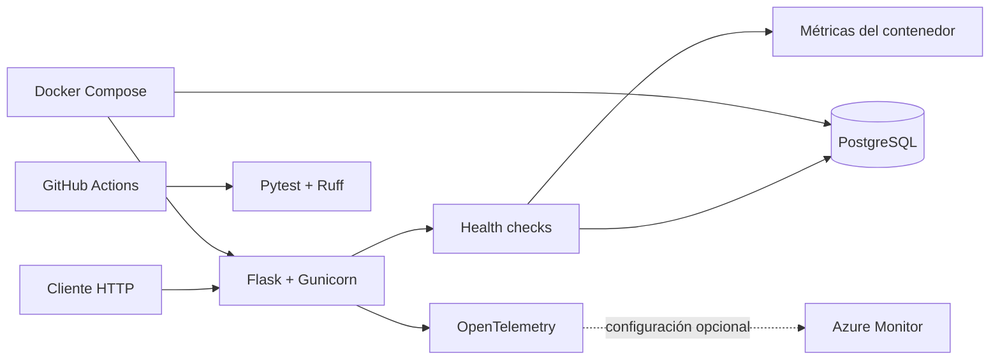

# Flask Telemetry API

API contenedorizada de referencia para demostrar observabilidad, health checks y despliegue reproducible de un servicio Python. Integra Flask, PostgreSQL, OpenTelemetry, Azure Monitor, Docker y pruebas automatizadas.

[](https://github.com/EmilianoMunoz/flask-telemetry-api/actions/workflows/ci.yml)


## Problema y propuesta

Una API no está realmente lista para operar si solo responde solicitudes: también debe indicar si el proceso sigue vivo, si sus dependencias están disponibles y qué recursos consume. Este proyecto presenta una base pequeña y reproducible que separa esas responsabilidades:

- **liveness** para comprobar que el proceso HTTP responde;
- **readiness** para validar la conexión con PostgreSQL;
- **métricas operativas** de CPU, memoria, disco y tiempo activo;
- **trazas distribuidas** con OpenTelemetry y exportación opcional a Azure Monitor;
- **ejecución local reproducible** mediante Docker Compose;
- **control de calidad** con Pytest, Ruff y GitHub Actions.

El objetivo no es resolver un dominio de negocio particular, sino exhibir una base de infraestructura aplicable a APIs y microservicios.

## Capacidades principales

- API JSON construida con el patrón *application factory* de Flask.
- Configuraciones separadas para desarrollo, producción y pruebas.
- Health checks independientes para proceso, base de datos y sistema.
- Consulta de disponibilidad de PostgreSQL de solo lectura.
- Instrumentación OpenTelemetry activada únicamente cuando existe configuración remota.
- Exportación de trazas a Azure Monitor/Application Insights.
- Imagen Docker ejecutada con un usuario sin privilegios.
- Servidor Gunicorn para ejecución productiva.
- Orquestación local de API y PostgreSQL con Docker Compose.
- Pipeline de integración continua para Python 3.11 y 3.12.

## Arquitectura



La aplicación funciona sin una cuenta de Azure. Cuando se define `APPLICATIONINSIGHTS_CONNECTION_STRING`, las solicitudes HTTP se instrumentan y sus trazas se exportan a Azure Monitor.

## Tecnologías

| Área | Tecnologías |
| --- | --- |
| Backend | Python, Flask, Gunicorn |
| Persistencia | PostgreSQL, Psycopg |
| Observabilidad | OpenTelemetry, Azure Monitor, psutil |
| Contenedores | Docker, Docker Compose |
| Calidad | Pytest, Ruff, GitHub Actions |

## Endpoints

| Método | Ruta | Propósito | Respuesta esperada |
| --- | --- | --- | --- |
| `GET` | `/` | Describe el servicio y sus rutas operativas | `200` |
| `GET` | `/health/live` | Comprueba que el proceso está disponible | `200` |
| `GET` | `/health/ready` | Verifica PostgreSQL | `200` o `503` |
| `GET` | `/health/system` | Informa métricas básicas del contenedor | `200` |

La respuesta de readiness no publica host, usuario, contraseña ni detalles internos de la excepción de conexión.

## Inicio rápido con Docker

### Requisitos

- Docker Engine con Docker Compose.
- Puerto local `5000` disponible.

### Ejecución

```bash
git clone https://github.com/EmilianoMunoz/flask-telemetry-api.git
cd flask-telemetry-api
cp .env.example .env
docker compose up --build
```

Comprobar el servicio:

```bash
curl http://localhost:5000/
curl http://localhost:5000/health/live
curl http://localhost:5000/health/ready
curl http://localhost:5000/health/system
```

Detener los contenedores:

```bash
docker compose down
```

Para eliminar también el volumen local de PostgreSQL:

```bash
docker compose down --volumes
```

## Desarrollo local

```bash
python3 -m venv .venv
source .venv/bin/activate
pip install -r requirements-dev.txt
cp .env.example .env
flask --app app.py run --debug
```

Si PostgreSQL se ejecuta fuera de Docker, deben adaptarse en `.env` las variables `AZURE_POSTGRESQL_*`.

## Pruebas y calidad

Ejecutar la suite:

```bash
pytest
```

Ejecutar el análisis estático:

```bash
ruff check .
```

Las pruebas cubren la descripción del servicio, la disponibilidad del proceso, el comportamiento de readiness sin base configurada y la exposición de métricas operativas. El workflow de CI repite ambas verificaciones en Python 3.11 y 3.12.

## Configuración

| Variable | Obligatoria | Descripción |
| --- | --- | --- |
| `FLASK_CONTEXT` | No | `development`, `production` o `testing` |
| `PORT` | No | Puerto usado por el servidor de desarrollo |
| `SERVICE_NAME` | No | Nombre del recurso OpenTelemetry |
| `SERVICE_NAMESPACE` | No | Agrupación lógica del servicio |
| `AZURE_POSTGRESQL_HOST` | Para readiness | Host de PostgreSQL |
| `AZURE_POSTGRESQL_DB` | Para readiness | Base de datos |
| `AZURE_POSTGRESQL_USER` | Para readiness | Usuario |
| `AZURE_POSTGRESQL_PASSWORD` | Para readiness | Contraseña |
| `AZURE_POSTGRESQL_PORT` | No | Puerto; valor predeterminado `5432` |
| `APPLICATIONINSIGHTS_CONNECTION_STRING` | No | Habilita la exportación a Azure Monitor |

`.env.example` contiene únicamente valores de desarrollo. El archivo `.env` está excluido de Git y no debe publicarse.

## Seguridad y decisiones operativas

- El contenedor se ejecuta con un usuario dedicado sin privilegios.
- Las credenciales se reciben exclusivamente mediante variables de entorno.
- Los health checks no devuelven credenciales ni mensajes internos de PostgreSQL.
- La comprobación de base de datos utiliza `SELECT 1` y no modifica tablas.
- La telemetría remota es opcional y falla de forma segura: la API continúa disponible si el exportador no puede iniciarse.
- Los workflows de CI solo solicitan permiso de lectura sobre el repositorio.

Para un entorno real se recomienda administrar secretos con el proveedor cloud correspondiente, restringir `/health/system` a una red operativa y definir límites de CPU y memoria.

## Estructura del repositorio

```text
.
├── app/
│   ├── config/          # Configuración por entorno
│   ├── resources/       # Endpoints HTTP y health checks
│   ├── __init__.py      # Application factory
│   └── observability.py # Instrumentación OpenTelemetry
├── tests/               # Pruebas automatizadas
├── .github/workflows/   # Integración continua
├── Dockerfile
├── compose.yml
├── requirements.txt
└── requirements-dev.txt
```

## Estado y alcance

El servicio implementa un flujo demostrable de observabilidad y operación local. Está pensado como proyecto de portfolio y como punto de partida para APIs con un dominio específico; no incluye autenticación, migraciones, métricas Prometheus ni infraestructura como código.

## Autor

Desarrollado por **Emiliano Muñoz**, estudiante avanzado de Ingeniería en Informática.
